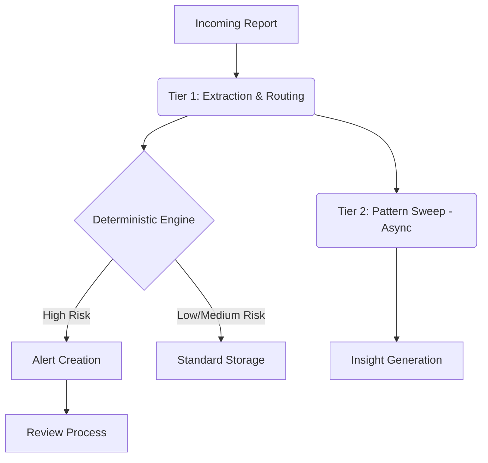

# PrecursorAI Architecture

## Core Principle: "AI reasons, deterministic code decides"
In PrecursorAI, Large Language Models (LLMs) are strictly used for reasoning and data extraction, while critical business logic and deterministic decision-making are handled by traditional code. This ensures safety, predictability, and auditability in compliance environments.

## Two-Tier Pipeline Architecture

PrecursorAI employs a two-tier pipeline architecture to process safety reports efficiently:

1. **Tier 1 (Real-time Triage):** Fast, synchronous processing of incoming safety reports. Extracts entities, assesses risk using the deterministic engine, and classifies the report. Raises immediate alerts if the risk is critical or high.
2. **Tier 2 (Pattern Intelligence):** Asynchronous, batch processing for deep analysis. Identifies trends, uncovers latent risks, and generates long-term insights using pattern recognition over historical data.

## Three-Factor SIF Test

The deterministic risk engine evaluates three core factors to classify a Severe Injury or Fatality (SIF) precursor:
1. **High Energy:** Was there a release of high energy? (e.g., electrical, gravitational, chemical)
2. **Person Exposed:** Was a person exposed to the energy release?
3. **Barrier Compromised:** Was a critical safety barrier compromised or absent?

If all three factors are true, it is classified as a SIF precursor. Other combinations result in classifications such as Capacity, Exposure, Low Energy, or Undetermined.

## Ruleset Versioning Model

Rules for extraction, risk assessment, and classification are versioned. Each safety report is processed against a specific ruleset version to maintain consistency and allow for auditing. Changes to the rulesets are tracked and can be rolled back if necessary.

## LLM Provider Abstraction

The system abstracts the underlying LLM provider. This allows for switching between different models (e.g., OpenAI, Anthropic, open-source models) without changing the core application logic. It also paves the way for on-premise deployments using local models to meet strict data privacy requirements.

## Auth/RBAC Model

Role-Based Access Control (RBAC) governs user permissions. Users are assigned roles (e.g., Admin, Safety Officer, Reviewer) which determine their access to different parts of the system, such as managing users, reviewing reports, or modifying rulesets. Authentication is handled via JWT tokens.

## Background Job Architecture

Background jobs (e.g., pattern sweeps, embedding backfills, SLA escalations) are managed by a Redis-backed queue system (Arq). This decouples long-running tasks from the main API, ensuring responsiveness and reliability.

## Data Flow Diagrams

## API Contract Overview

The API follows RESTful principles and uses JSON for data exchange. Key endpoints include:
- `POST /api/v1/reports`: Submit a new safety report.
- `GET /api/v1/reports/{id}`: Retrieve report details.
- `PUT /api/v1/reports/{id}/review`: Submit a review for a report.
- `POST /api/v1/auth/login`: Authenticate and receive a JWT.
- `GET /api/v1/alerts`: List active alerts.
