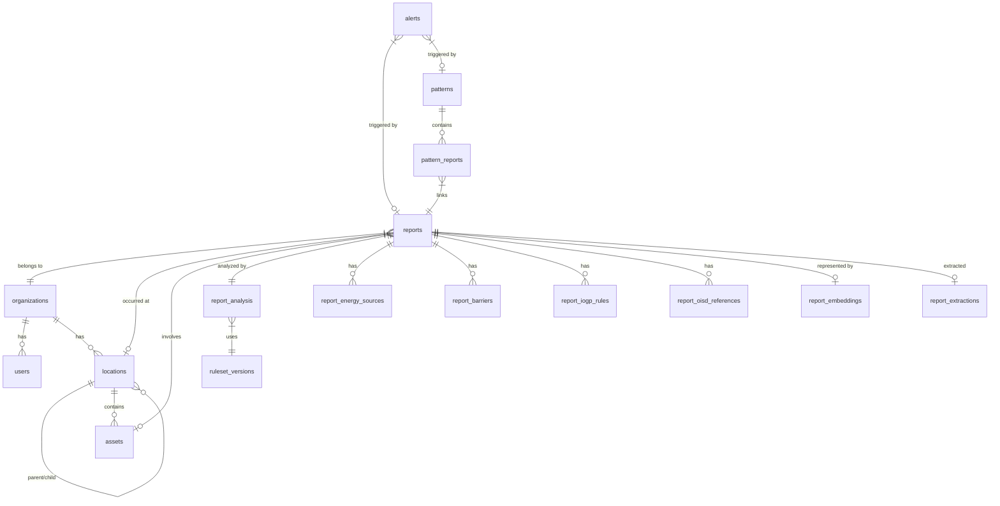

# PrecursorAI Database Schema

This document outlines the database schema, including tables, relationships, enumeration types, Row-Level Security (RLS) model, and the critical pgvector dimensionality decision.

## Critical pgvector Decision (Option A)

The `gemini-embedding-001` model natively produces 3072-dimensional vectors. However, **pgvector cannot build an ANN index (IVFFlat/HNSW) for columns with >2000 dimensions** using the standard `vector` type.

**Decision: Option A (Matryoshka Truncation + pgvector ≥ 0.8)**
- We have reduced the embedding output to **1536 dimensions** via the Gemini API's `output_dimensionality=1536` configuration (utilizing Matryoshka representation and normalization).
- We upgraded pgvector to version **0.8+** (rebuilding the Docker image).
- Embeddings are stored as `vector(1536)`.
- We build an **HNSW** index using `vector_cosine_ops` for fast similarity search.
- All existing 3072-dimensional rows will be re-embedded to 1536 dimensions via a background backfill job.

## Core SIF Logic in Database

The logic for determining a Serious Injury or Fatality (SIF) Precursor is encoded directly into the database as a deterministic Boolean formula mapped in `report_analysis`:

1. **High-Energy Source Present** (`high_energy_present`)
2. **Person in Danger Zone** (`person_in_danger_zone`)
3. **Barrier Compromised** (`barrier_compromised`)

`HIGH-ENERGY SOURCE + PERSON IN DANGER Zone + FAILED/MISSING/BYPASSED BARRIER = SIF PRECURSOR`

This logic uses the `ruleset_versions` table to map these booleans into a `sif_classification` (e.g., PSIF, HSIF).

## Entity Relationship Diagram

## Enumeration Types

- `user_role`: `HSSE_OFFICER`, `SITE_MANAGER`, `OPS_MANAGER`, `CORPORATE_LEADERSHIP`, `ADMIN`
- `report_type`: `SAFETY_OBSERVATION`, `NEAR_MISS`, `UNSAFE_ACT`, `UNSAFE_CONDITION`, `INCIDENT`, `HIPO_NEAR_MISS`
- `sif_classification`: `HSIF`, `PSIF`, `LSIF`, `CAPACITY`, `EXPOSURE`, `LOW_ENERGY`, `UNDETERMINED`
- `barrier_status`: `INTACT`, `DEGRADED`, `MISSING`, `BYPASSED`, `FAILED`, `UNKNOWN`
- `energy_type`: `GRAVITY`, `MOTION`, `MECHANICAL`, `ELECTRICAL`, `PRESSURE`, `TEMPERATURE`, `CHEMICAL`, `RADIATION`, `FIRE_EXPLOSION`, `SOUND`, `BIOLOGICAL`
- `escalation_level`: `CRITICAL`, `HIGH`, `REVIEW`, `ROUTINE`
- `severity`: `LOW`, `MEDIUM`, `HIGH`, `CRITICAL`
- `alert_status`: `OPEN`, `ACKNOWLEDGED`, `IN_REVIEW`, `ESCALATED`, `CLOSED`, `DISMISSED`
- `location_level`: `WORLD`, `COUNTRY`, `REGION`, `FIELD`, `SITE`
- `asset_type`: `DRILLING_RIG`, `WORKOVER_RIG`, `WELLHEAD`, `BOP_WELL_CONTROL`, `PRODUCTION_FIELD`, `COMPRESSOR_STATION`, `PUMPING_UNIT`, `OIL_COLLECTION_STATION`, `GGS`, `PIPELINE`

## Row-Level Security (RLS)

- **Isolation**: Tenant data is isolated by `org_id` on all business tables.
- **Enforcement**: Policies utilize Postgres RLS. It can work via:
  - Backend GUC setting (`SET LOCAL app.current_org = ...`) inside transaction blocks.
  - Supabase Auth integration (`auth.jwt() ->> 'org_id'`).
- **RBAC**: Access to transition alerts or change statuses is gated by the `user_role` within the tenant.
